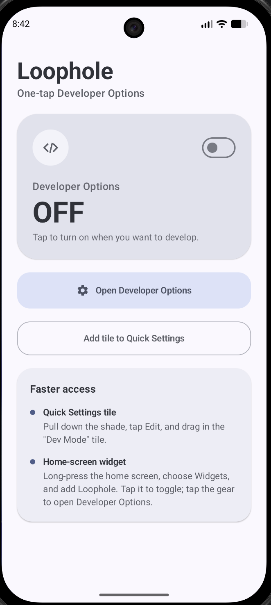
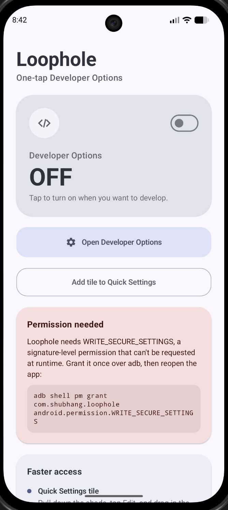
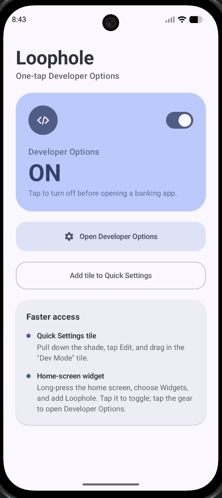
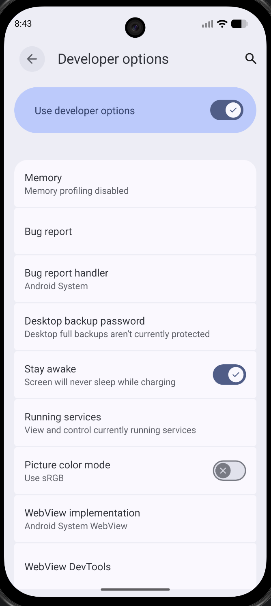
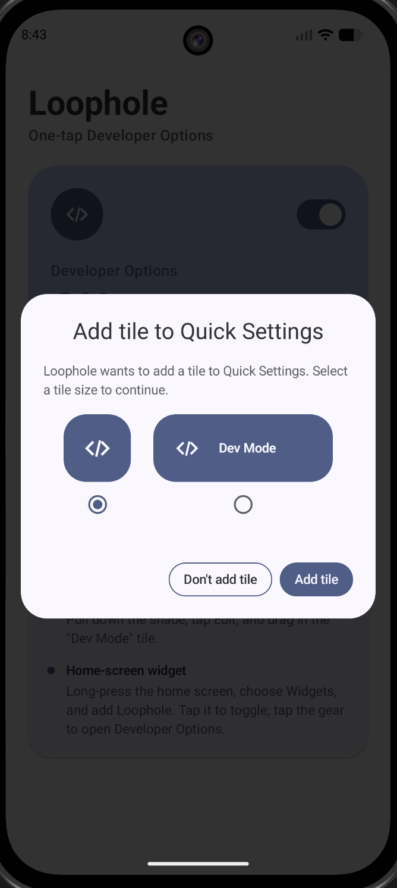
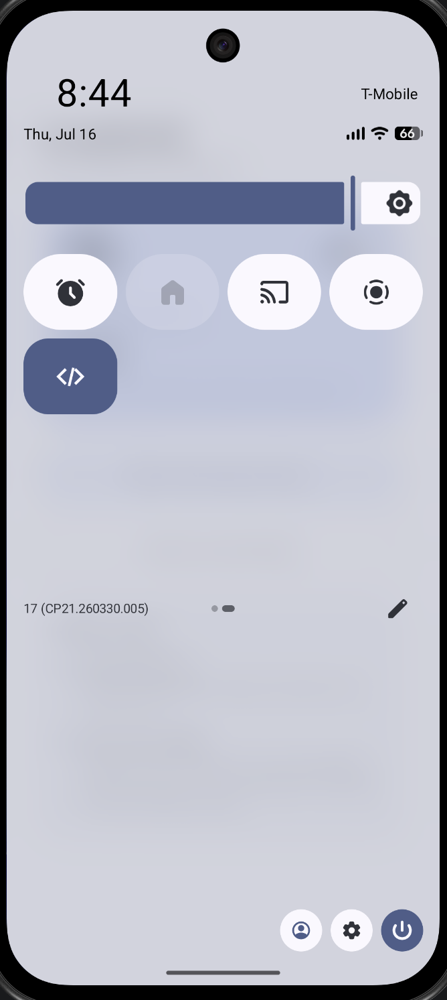
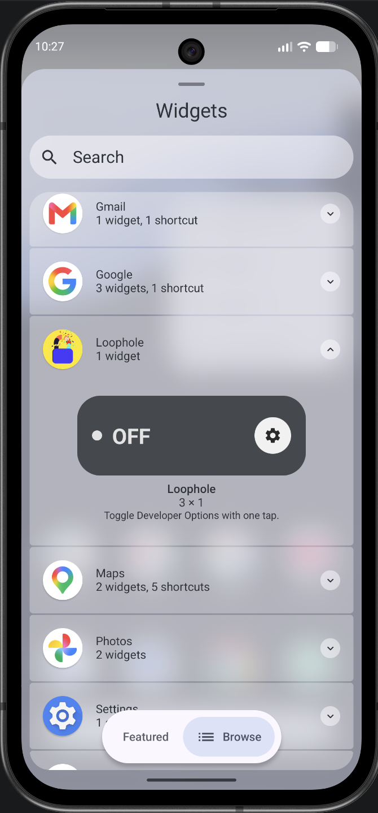
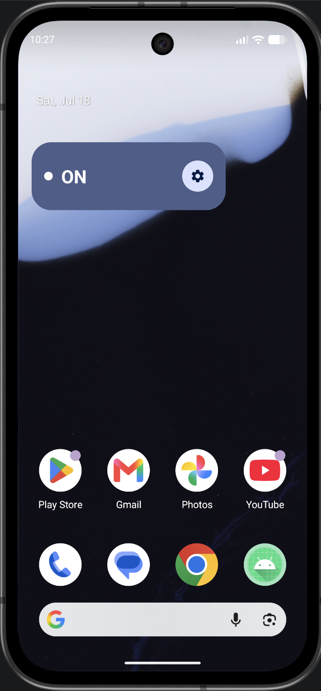
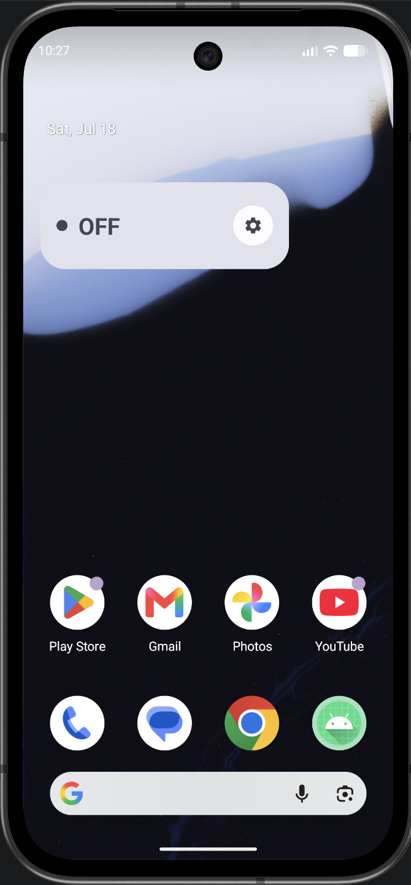

<p align="center">
  
</p>

<h1 align="center">
  <!--  -->
  
  
  Loophole
</h1>

<p align="center"><b>A one-tap Quick Settings toggle for Android Developer Options — so your banking apps stop throwing a fit while you're building.</b></p>

<p align="center">
  <a href="LICENSE"></a>
  
  
  
  <a href="CONTRIBUTING.md"></a>
</p>

---

## The problem

If you're an Android developer, Developer Options is basically always on. But
a lot of banking and fintech apps treat that as a red flag and refuse to
open, or silently degrade, while it's enabled — even though you're not doing
anything shady, you're just building.

The normal fix is: open Settings → System → Developer Options → toggle it off
→ open your banking app → remember to go back and turn it on again later.
Every. Single. Time.

**Loophole** turns that into one tap from the notification shade.

## What it does

- Reads and toggles `Settings.Global.DEVELOPMENT_SETTINGS_ENABLED` directly
- Ships as a **Quick Settings tile** — pull down the shade, tap, done
- Includes a simple in-app switch as a fallback / status view
- No ads, no analytics, no network permissions at all — it touches exactly
  one system setting and nothing else

## Screenshots

<p align="center">
  
  
  
  
  
  
  
  
  
</p>

## How it works

Toggling Developer Options programmatically requires
`android.permission.WRITE_SECURE_SETTINGS` — a **signature-level permission**.
Android will never show a runtime permission dialog for it, no matter what
your manifest says. The only way to grant it is once, via `adb`, with the
device connected:

```bash
adb shell pm grant com.shubhang.loophole android.permission.WRITE_SECURE_SETTINGS
```

If you have more than one device connected, target the specific one:

```bash
adb devices                     # list connected devices/serials
adb -s <serial> shell pm grant com.shubhang.loophole android.permission.WRITE_SECURE_SETTINGS
```

Once granted, the app can flip the setting instantly via
`Settings.Global.putInt()`. The Quick Settings tile (`TileService`) reflects
live state using `onStartListening()` and updates `Tile.STATE_ACTIVE` /
`STATE_INACTIVE` on every toggle.

## Installation

### Build from source

```bash
git clone https://github.com/shubhang-d/loophole.git
cd loophole
./gradlew assembleDebug
adb install app/build/outputs/apk/debug/app-debug.apk
```

### Or download a prebuilt APK

Grab the latest APK from the [Releases](../../releases) page and sideload it.

> **This app cannot be distributed on the Play Store** as-is. Play doesn't
> allow apps to instruct users through an adb-based permission grant as part
> of normal onboarding. This is a sideload / personal-use tool by design.

### One-time setup (required)

```bash
adb shell pm grant com.shubhang.loophole android.permission.WRITE_SECURE_SETTINGS
```

Then add the tile: pull down Quick Settings → tap the edit (pencil) icon →
drag **Loophole** into your active tiles.

## Security & trust

Granting `WRITE_SECURE_SETTINGS` is not something to do casually, so to be
upfront about it:

- The app touches **one setting only**: `DEVELOPMENT_SETTINGS_ENABLED`. It
  does not read or write any other secure setting.
- There are no network permissions in the manifest — the app cannot phone
  home even if it wanted to.
- The entire source is here for you to audit before granting the permission.
  If you don't trust a binary, build it yourself from source.

## Limitations

- **Permission doesn't survive a fresh install.** If you uninstall and
  reinstall (not just update), you'll need to re-run the `adb grant` command.
- **This only flips one flag.** Some banking apps check more than
  `DEVELOPMENT_SETTINGS_ENABLED` — e.g. USB debugging status, mock-location
  settings, or root/Play Integrity signals. If a specific app still blocks
  you with this off, it's likely checking something else.
- **Some OEM skins cache the Settings UI.** The underlying value flips
  instantly, but the stock Settings app may not visibly refresh until
  reopened. This is cosmetic only and doesn't affect what banking apps read.

## Tech stack

- Kotlin + Jetpack Compose + Material 3
- `TileService` (Quick Settings API), minSdk 24
- No third-party dependencies beyond AndroidX/Compose

## Contributing

Issues and PRs are welcome. If you're adding a feature, please keep the
permission footprint minimal — that's the whole point of this app.

## License

[MIT](LICENSE) — do whatever you want with it.

## Author

Built by **Shubhang** ([@shubhang-d](https://github.com/shubhang-d)) —
follow build-in-public content at [@heyshubhang](https://instagram.com/heyshubhang).

If this saved you from toggling Developer Options manually for the
hundredth time, a ⭐ on the repo is appreciated.
